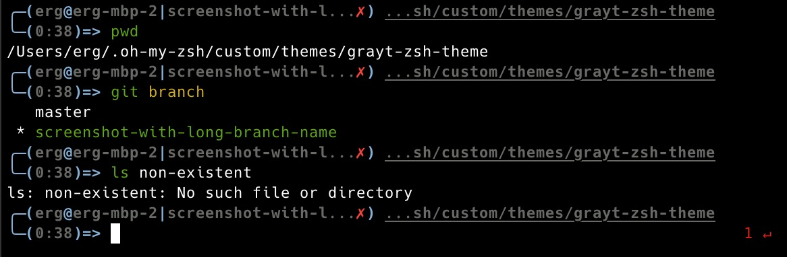

# grayt-zsh-theme
A simple, yet informative, zsh theme

## Installation
Clone the repository, preferably under `$ZSH_CUSTOM/themes`. Then, link the
theme directly in the `$ZSH_CUSTOM/themes` directory.
```sh
git clone https://github.com/evanthegrayt/grayt-zsh-theme.git $ZSH_CUSTOM/themes
ln -s $ZSH_CUSTOM/themes/grayt-zsh-theme/grayt.zsh-theme $ZSH_CUSTOM/themes
```
Once installed, set the theme in your `~/.zshrc` file.
```sh
export ZSH_THEME="grayt"
```
Re-source your `~/.zshrc`
```sh
. ~/.zshrc
```

## Screenshots
Here's a few examples, including a non-`git` directory, a clean `git` directory,
an un-clean `git` directory, and a non-zero return code.
I'm using [iTerm2](https://www.iterm2.com/) on MacOS, with
the [Hack font](https://sourcefoundry.org/hack/).



## Issues and Reporting Bugs
This prompt works great for me 99% of the time, but since the `git` branch and
`$PWD` are on the same line, if you have a long branch name and a long path, it
can get too long, and even sometimes wrap. I'd like to truncate either one or
both of them if the character limit is over a certain amount. I just haven't
looked into doing this yet. Feel free to contribute if you'd like, or [submit an
issue](https://github.com/evanthegrayt/grayt-zsh-theme/issues/new) if you find
bugs.

